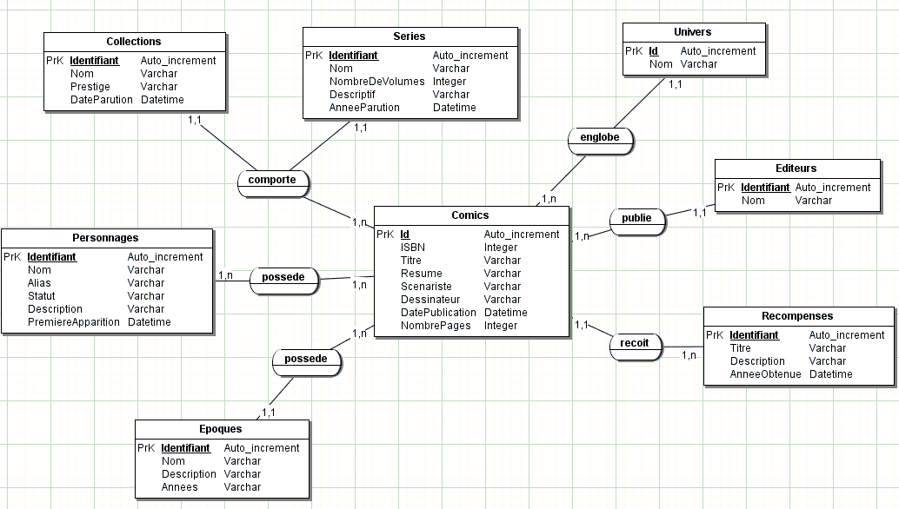
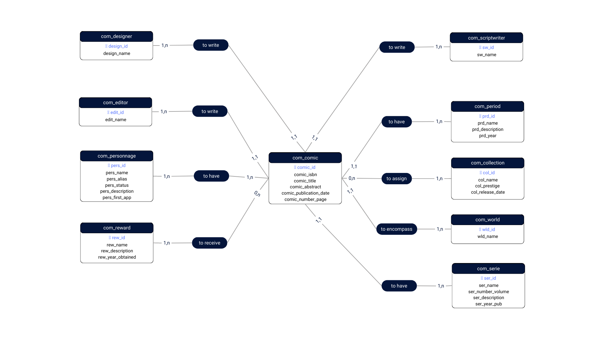

# Création d'une base de données

En utilisant les informations du MCD. 

Nous devions procéder aux corrections qui nous semblent nécessaires (avec une justification de nos choix). Puis créer la base de données sous MySQL.

## Livrables : 
* Un fichier d'import de la base de données dans un repo git. 
* Un fichier décrivant la démarche et les choix.

## Proposition MCD corrigé : 

### Cardinalité :

J'ai noté des incohérences dans le placement et le choix de cardinalité :
(Pour faciliter la compréhension j'ai modifier les verbes de relations)

- une collection peut être atribué à un ou plusieurs comics
- un comics est atribué à aucune ou plusieurs collections

- une serie peut avoir un à plusieurs comics
- un comics a une et une seul series

- un univer est englobé dans un ou plusieurs comics
- un comics englobe un et un seul univer

- un éditeur publie  un ou plusieurs comics
- un comics peut être publié par un et un seul éditeur

- une récompense peut être recu pour un et un seul comics
- un comics peut recevoir aucune ou plusieur récompense

- une époque peut être possédé par un ou plusieur comics
- un comics possede une et une seule époque

- un personnage est contenu dans un ou plusieurs comics
- un comics contient un ou plusieurs personnages

- un Scénariste peut écrire un ou plusieurs comics
- Un Comics est écrit par un et un seul Scénariste

- Un Déssinateur peut dessiner un ou plusieurs comics
- Un Comics est déssiné par un et un seul Déssinateur

### Modification d'entité

- En vue d'une évolution de la BDD est acceuillir des éléments plus précis sur des propriétés (exemple : biographie, ...), j'ai créé deux nouvelles entités :
  - Scénariste 
  - Déssinateur

- Pour harmoniser les propriétés :
  - j'ai revoir le nomage de propriétés exemple : id au lieu identifiant
  - modifier le type de données pour etre représentatif de la propriété exemple :  Années modifier en years au lieu de varchar

### Normalisation des noms
La normalisation a pour but de proposer une méthode et une normalisation interne de l'ensemble des éléments composant une base de données.
Une normalisation interne (mes règles propres) a beaucoup d'intérêt en matière de développement informatique : elle facilite le travail de tous, en équipe, comme le travail solitaire. Elle permet de repérer facilement la nature et le contenu d'un objet par son simple nom évitant ainsi d'établir un descriptif très complet de l'ensemble des composants d'une base de données. Enfin, elle optimise l'exécution des procédures et requêtes.
Des règles simples et de bon sens sont un gage d'application facile à écrire, bien développée et surtout PORTABLE d'un environnement l'autre ou d'un SGBDR à l'autre.

#### Le vocabulaire

- **Une entité** est un ensemble de données cohérentes ayant des caractéristiques communes (PERSONNE, VEHICULE…).
- **Une relation** (ou association) représente un moyen de relier, souvent par une action deux ou plus de deux entités (personne CONDUIT véhicule).
- **Un attribut** est une propriété ou caractéristique qualifiant l'entité (personne.SEXE, vehicule.IMMATRICULATION). Il possède un nom et un type de donnée.
- **La cardinalité** est le nombre possible des liens d'une relation (personne conduit 0 ou 1 véhicule, personne possède 0 ou N véhicules).
- **Un identifiant** est un attribut ou un ensemble d'attributs permettant d'identifier de façon unique une occurrence de l'entité (le n° de sécurité sociale 1600475112335 permet d'identifier de manière unique une personne).
- **Une clef étrangère** est un attribut d'une relation qui fait référence à la clef d'une autre relation, c'est ainsi que l'on pourra lier plusieurs relations.

#### Le Nommage : 

Le nomage doit être significatifs, pertinents et en anglais. Il doit être constitués uniquement des caractères suivants :
[a .. z] + [0 .. 9] +[ _ ]
il ne doit pas :
 - dépasser 128 caractères
 - commencer par un chiffre
 - avoir plusieurs caractères « blanc souligné » de suite
 - être un mot réservé de SQL
 - être écrit en majuscule
 - être écrit au pluriel
 - être écrit en francais

##### Nom d'une base de données :

Le nom d'une base de données doit commencer par le préfixe **bd_** suivi d'une indication pertinente. exemple: bd_comic

##### Nom d'une entité : 

Elle doit commencer par un préfixe, se préfixe doit être suffisament éloquant pour représenté la BDD et être le meme préfixe pour toutes les entités de la bdd. il est séparé du nom par un "_"

exemple entité serie : BDD = "comic" => préfixe = com_serie

##### Nom d'une entité relation (table pivot):

Elle doit commencer par un préfixe, se préfixe doit être suffisament éloquant pour représenté la BDD et être le meme préfixe pour toutes les entités de la bdd. Pour pouvoir les distingués plus facilement et permettre de comprendre la relation, nous allons resaisir les noms des entités qui compose la relation séparé par _
(voir exemple) 

exemple relation personnage et comic : BDD = "comic" => préfixe = com_personnage_comic

##### Nom d'un attribut :

Le nom d'un attribut doit être suffisamment pertinent pour que l'on puisse comprendre la nature du type de données qu'il représente. Elle doit commencer par un préfixe, se préfixe doit être suffisament éloquant pour représenté la table. Il est séparé du nom par un "_"

exemple table personnage : attribit = "id" => préfixe = pers_id

##### Avantage d'utiliser des prefixe :

- Préfixer les noms des tables
  - Permet d’éviter d’utiliser accidentellement des mots réservés.
  - Permet d’éviter les conflits lorsqu’il y a plusieurs logiciels similaires sur une même base de données (par exemple, si 2 logiciels utilisent chacun une table intitulée “utilisateur”).
  - Utile pour séparer facilement les tables associée à un système ou à un autre. Par exemple si un blog WordPress et une boutique e-commerce Prestashop sont placé sur une même base de données, le blog aura des tables commençant par “wp_” tandis que la boutique aura des tables commançant par “ps_”.
  - C’est plus simple pour ré-installer un backup. Par exemple, pour réinstaller une sauvegarde du blog, il est possible d’ajouter des tables commençant par “wp2013_” puis de modifier le code de l’application pour tout migrer d’un coup.
  - Sur des gros projets ça peut être pratique pour que toutes les tables associées aux utilisateurs commence par exemple par “user_”, toutes celles concernant les produits par “product_” et ainsi de suite.

##### Reconnaitre l'attribut type clé étrangère :

Lorsqu’une clé étrangère est utilisée (traduction anglaise : “Foreign Key”), il est pratique de l’indiquer dans le nom de la colonne. La colonne peut contenir le préfixe, puis “fk” pour Foreign Key, puis le nom de la table et enfin se terminer par “id”. Ainsi, une colonne pourrait s’intituler “wp_fk_user_id” (cf. préfixe “wp”, foreign key sur la table utilisateur de la colonne “id”).